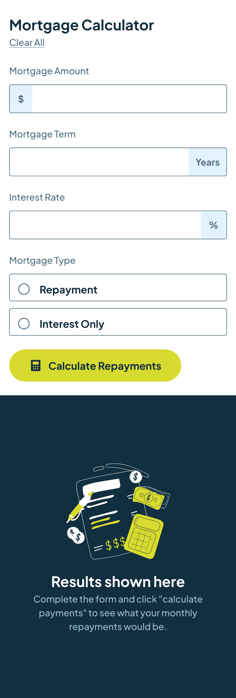
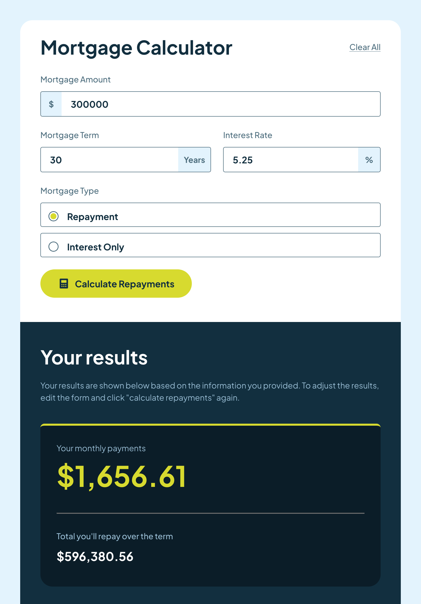
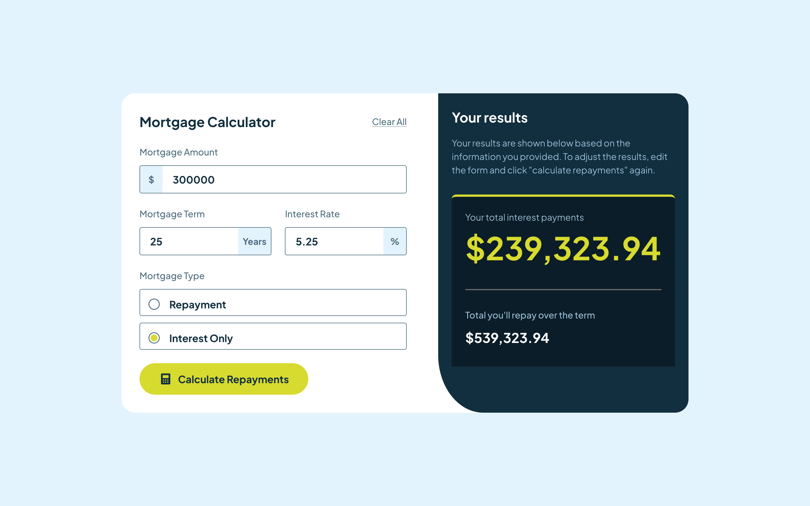

# Frontend Mentor - Mortgage repayment calculator solution

This is a solution to the [Mortgage repayment calculator challenge on Frontend Mentor](https://www.frontendmentor.io/challenges/mortgage-repayment-calculator-Galx1LXK73). Frontend Mentor challenges help you improve your coding skills by building realistic projects.

## Table of contents

- [Frontend Mentor - Mortgage repayment calculator solution](#frontend-mentor---mortgage-repayment-calculator-solution)
  - [Table of contents](#table-of-contents)
  - [Overview](#overview)
    - [The challenge](#the-challenge)
    - [Screenshot](#screenshot)
    - [Links](#links)
  - [My process](#my-process)
    - [Built with](#built-with)
    - [What I learned](#what-i-learned)
    - [Continued development](#continued-development)
    - [Useful resources](#useful-resources)
  - [Author](#author)

## Overview

### The challenge

Users should be able to:

- Input mortgage information and see monthly repayment and total repayment amounts after submitting the form
- See form validation messages if any field is incomplete
- Complete the form only using their keyboard
- View the optimal layout for the interface depending on their device's screen size
- See hover and focus states for all interactive elements on the page

### Screenshot





### Links

- Solution URL: [Add solution URL here](https://your-solution-url.com)
- Live Site URL: [mortgage_calculator_app](https://mayor-creator.github.io/mortgage_calculator_app/)

## My process

### Built with

- Semantic HTML5 markup
- CSS Styled Module properties
- Flexbox
- Mobile-first workflow
- [React](https://reactjs.org/) - JS library

### What I learned

```js
const originalTotalInterest = (principal, years, rate) => {
  const numberOfMonth = Number(years * 12);
  const monthlyPaid = monthlyPayment(principal, years, rate);

  let totalInterestPaid = 0;
  let balance = principal;

  for (let i = 1; i <= numberOfMonth; i++) {
    const monthlyInterest = balance * interestRate(rate);
    totalInterestPaid += monthlyInterest;
    balance -= monthlyPaid - monthlyInterest;
  }
  return Number(totalInterestPaid.toFixed(2));
};
```

### Continued development

- Error handling in React JS
- React Hooks and Forms
- Styled Components

### Useful resources

- [Pure CSS Custom Styled Radio Buttons](https://moderncss.dev/pure-css-custom-styled-radio-buttons/#radio-button-html) - This is an amazing article explains how different browser style radio buttons and how to customize it.

## Author

- Github - [mayor-creator](https://github.com/mayor-creator)
- Frontend Mentor - [@mayor-creator](https://www.frontendmentor.io/profile/mayor-creator)
- Threads - [@mayor_creator](https://www.threads.net/@mayor_creator)
